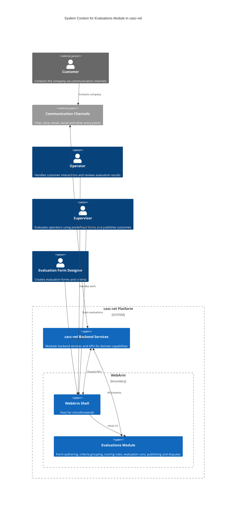

## About the Module

Evaluation Forms is a component of the **casc-vel** product. It lets supervisors create evaluation forms with criteria to assess operator performance. Supervisors define and group criteria and configure scoring rules to compute the final score. After an evaluation is completed, a supervisor can publish the result for the operator to review. Operators can review the result and, if needed, dispute the evaluation.

## Architecture

### C4 - Context

