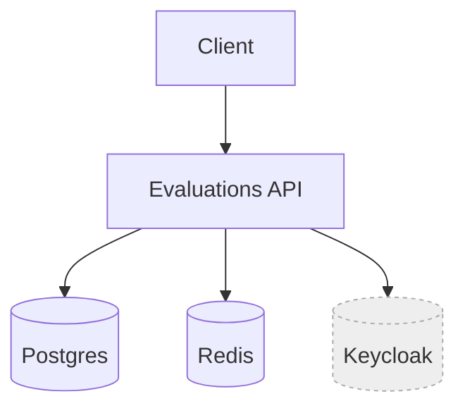

# Architecture (draft)

```mermaid
flowchart TD
Client --> API[Evaluations API]
API --> PG[(Postgres)]
API --> Redis[(Redis)]
API --> Keycloak[(Keycloak)]:::opt
classDef opt fill:#eee,stroke:#aaa,stroke-dasharray: 3 3
```
