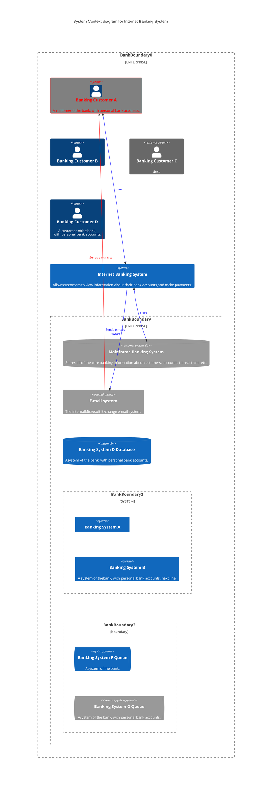

# Architecture (draft)

```mermaid
C4Context
  title System Context diagram for Internet Banking System
  Enterprise_Boundary(b0, "BankBoundary0") {
    Person(customerA, "Banking Customer A", "A customer ofthe bank, with personal bank accounts.")
    Person(customerB, "Banking Customer B")
    Person_Ext(customerC, "Banking Customer C", "desc")
    Person(customerD, "Banking Customer D", "A customer ofthe bank, <br/> with personal bank accounts.")
    System(SystemAA, "Internet Banking System", "Allowscustomers to view information about their bank accounts,and make payments.")
    Enterprise_Boundary(b1, "BankBoundary") {
      SystemDb_Ext(SystemE, "Mainframe Banking System","Stores all of the core banking information aboutcustomers, accounts, transactions, etc.")
      System_Boundary(b2, "BankBoundary2") {
        System(SystemA, "Banking System A")
        System(SystemB, "Banking System B", "A system of thebank, with personal bank accounts. next line.")
      }
      System_Ext(SystemC, "E-mail system", "The internalMicrosoft Exchange e-mail system.")
      SystemDb(SystemD, "Banking System D Database", "Asystem of the bank, with personal bank accounts.")
      Boundary(b3, "BankBoundary3", "boundary") {
        SystemQueue(SystemF, "Banking System F Queue", "Asystem of the bank.")
        SystemQueue_Ext(SystemG, "Banking System G Queue", "Asystem of the bank, with personal bank accounts.")
      }
    }
  }
  BiRel(customerA, SystemAA, "Uses")
  BiRel(SystemAA, SystemE, "Uses")
  Rel(SystemAA, SystemC, "Sends e-mails", "SMTP")
  Rel(SystemC, customerA, "Sends e-mails to")
  UpdateElementStyle(customerA, $fontColor="red",$bgColor="grey", $borderColor="red")
  UpdateRelStyle(customerA, SystemAA, $textColor="blue",$lineColor="blue", $offsetX="5")
  UpdateRelStyle(SystemAA, SystemE, $textColor="blue",$lineColor="blue", $offsetY="-10")
  UpdateRelStyle(SystemAA, SystemC, $textColor="blue",$lineColor="blue", $offsetY="-40", $offsetX="-50")
  UpdateRelStyle(SystemC, customerA, $textColor="red",$lineColor="red", $offsetX="-50", $offsetY="20")
  UpdateLayoutConfig($c4ShapeInRow="3", $c4BoundaryInRow="1")
```