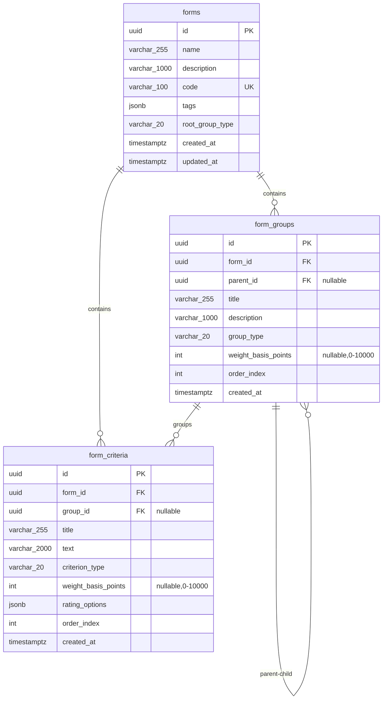

# Database Schema

This document describes the current PostgreSQL database schema for the Evaluations Management module.

## Entity Relationship Diagram



## Tables Description

### forms

The root aggregate for evaluation forms. Contains metadata and configuration.

**Key Columns:**
- `id` - Primary key (UUID)
- `code` - Unique business identifier for the form
- `tags` - JSONB array for categorization and search
- `root_group_type` - Type of root group: 'average' or 'weighted'

**Indexes:**
- `idx_forms_code` (UNIQUE) - On `code` column
- `idx_forms_tags` (GIN) - JSONB index on `tags`

### form_groups

Hierarchical groups organizing criteria within forms. Supports both average and weighted scoring strategies.

**Key Columns:**
- `id` - Primary key (UUID)
- `form_id` - Foreign key to `forms` table
- `parent_id` - Self-referential FK for hierarchy (nullable)
- `group_type` - Type: 'average' or 'weighted'
- `weight_basis_points` - Weight in basis points (0-10000), required for weighted type
- `order_index` - Display order within parent context

**Indexes:**
- `idx_form_groups_form_id` - On `form_id`
- `idx_form_groups_parent_id` - On `parent_id`
- `idx_form_groups_order` - Composite on `(form_id, parent_id, order_index)`

**Foreign Keys:**
- `fk_form_groups_form_id` → `forms(id)` ON DELETE CASCADE
- `fk_form_groups_parent_id` → `form_groups(id)` ON DELETE CASCADE

### form_criteria

Individual evaluation criteria with rating options.

**Key Columns:**
- `id` - Primary key (UUID)
- `form_id` - Foreign key to `forms` table
- `group_id` - Foreign key to `form_groups` table (nullable)
- `criterion_type` - Type: 'average' or 'weighted'
- `weight_basis_points` - Weight in basis points (0-10000), required for weighted type
- `rating_options` - JSONB array of rating options with score, label, and annotation
- `order_index` - Display order within parent context

**Indexes:**
- `idx_form_criteria_form_id` - On `form_id`
- `idx_form_criteria_group_id` - On `group_id`
- `idx_form_criteria_order` - Composite on `(form_id, group_id, order_index)`

**Foreign Keys:**
- `fk_form_criteria_form_id` → `forms(id)` ON DELETE CASCADE
- `fk_form_criteria_group_id` → `form_groups(id)` ON DELETE CASCADE

**Constraints:**
- `chk_form_criteria_rating_options_not_empty` - Ensures `rating_options` array has at least one element
- `trg_check_criterion_group_type_match` - Trigger ensuring criterion type matches group type

## rating_options JSONB Structure

The `rating_options` column in `form_criteria` stores an array of objects with the following structure:

```json
[
  {
    "score": 5.0,
    "label": "Excellent",
    "annotation": "Outstanding performance exceeding expectations"
  },
  {
    "score": 4.0,
    "label": "Good",
    "annotation": "Solid performance meeting expectations"
  },
  {
    "score": 3.0,
    "label": "Satisfactory",
    "annotation": "Acceptable performance with room for improvement"
  }
]
```

**Fields:**
- `score` - Numeric value (decimal)
- `label` - Display label (string)
- `annotation` - Optional description/help text (string, can be empty)

## Data Integrity Rules

### Type Matching (Migration 0003)

A database trigger (`trg_check_criterion_group_type_match`) enforces that:
- Average criteria can only be added to average groups
- Weighted criteria can only be added to weighted groups
- This is enforced at the database level, independent of application logic

### Weight Validation

For weighted scoring:
- At each level (root, groups, criteria within group), sibling weights must sum to 10000 basis points (100%)
- This is validated by application logic before persisting

### Cascading Deletes

All foreign keys use `ON DELETE CASCADE`:
- Deleting a form deletes all its groups and criteria
- Deleting a group deletes all its child groups and criteria

## Migrations

The schema is managed through SQL migration scripts:

1. **0001-initial-schema.sql** - Initial table structure
2. **0002-add-type-constraints.sql** - Additional type constraints
3. **0003-add-criterion-group-type-match-constraint.sql** - Type matching trigger
4. **0004-move-rating-options-to-jsonb.sql** - Refactored rating_options to JSONB

All migrations are idempotent and safe to run multiple times.
