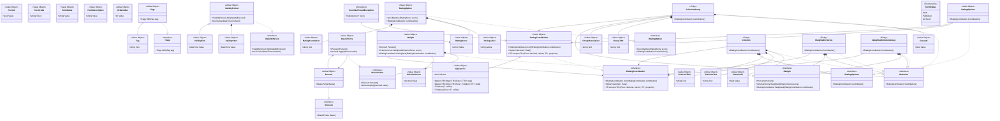

# Domain

```mermaid
classDiagram
    %% Identifiers
    class FormId {
        <<Value Object>>
        +Guid Value
    }

    class GroupId {
        <<Value Object>>
        +Guid Value
    }

    class CriterionId {
        <<Value Object>>
        +Guid Value
    }

    %% Form Metadata
    class FormCode {
        <<Value Object>>
        +string Token
    }

    class FormName {
        <<Value Object>>
        +string Value
    }

    class FormDescription {
        <<Value Object>>
        +string Value
    }

    class OrderIndex {
        <<Value Object>>
        +int Value
    }

    class Tag {
        <<Value Object>>
        +string Text
    }

    class Tags {
        <<Value Object>>
        +ITags With(Tag tag)
    }

    class ITags {
        <<Interface>>
        +ITags With(Tag tag)
    }

    Tags ..|> ITags
    Tags o-- Tag

    %% Validity Period
    class ValidityStart {
        <<Value Object>>
        +DateTime Value
    }

    class ValidityEnd {
        <<Value Object>>
        +DateTime Value
    }

    class ValidityPeriod {
        <<Value Object>>
        +IValidityPeriod Until(ValidityEnd end)
        +bool Active(DateTime moment)
    }

    class IValidityPeriod {
        <<Interface>>
        +IValidityPeriod Until(ValidityEnd end)
        +bool Active(DateTime moment)
    }

    ValidityPeriod ..|> IValidityPeriod
    ValidityPeriod *-- ValidityStart
    ValidityPeriod o-- ValidityEnd

    %% Weighting
    class BasisPoints {
        <<Value Object>>
        +IPercent Percent()
        +decimal Apply(decimal value)
    }

    class Percent {
        <<Value Object>>
        +IBasisPoints Basis()
    }

    class Weight {
        <<Value Object>>
        +IPercent Percent()
        +CriterionScore Weighted(CriterionScore score)
        +IRatingContribution Weighted(IRatingContribution contribution)
    }

    class IBasisPoints {
        <<Interface>>
        +IPercent Percent()
        +decimal Apply(decimal value)
    }

    class IPercent {
        <<Interface>>
        +IBasisPoints Basis()
    }

    class IWeight {
        <<Interface>>
        +IPercent Percent()
        +CriterionScore Weighted(CriterionScore score)
        +IRatingContribution Weighted(IRatingContribution contribution)
    }

    BasisPoints ..|> IBasisPoints
    Percent ..|> IPercent
    Weight ..|> IWeight
    Weight *-- IBasisPoints
    BasisPoints --> Percent
    Percent --> BasisPoints
    Weight --> CriterionScore
    Weight --> IRatingContribution

    %% Rating Components
    class RatingScore {
        <<Value Object>>
        +ushort Value
    }

    class RatingLabel {
        <<Value Object>>
        +string Value
    }

    class RatingAnnotation {
        <<Value Object>>
        +string Text
    }

    class RatingOption {
        <<Value Object>>
        +bool Matches(RatingScore score)
        +IRatingContribution Contribution()
    }

    class IRatingOption {
        <<Interface>>
        +bool Matches(RatingScore score)
        +IRatingContribution Contribution()
    }

    class RatingOptions {
        <<Value Object>>
        +IRatingContribution Contribution()
    }

    class IRatingOptions {
        <<Interface>>
        +IRatingContribution Contribution()
    }

    RatingOption ..|> IRatingOption
    RatingOption *-- RatingScore
    RatingOption *-- RatingLabel
    RatingOption *-- RatingAnnotation
    RatingOption --> RatingContribution
    RatingOptions ..|> IRatingOptions
    RatingOptions o-- IRatingOption
    RatingOptions --> RatingContribution

    %% Criterion Scores
    class CriterionScore {
        <<Value Object>>
        +decimal Value
    }

    %% Contributions
    class IRatingContribution {
        <<Interface>>
        +IRatingContribution Join(IRatingContribution contribution)
        +Option~decimal~ Total()
        +TR Accept~TR~(Func~decimal, ushort, TR~ projector)
    }

    class RatingContribution {
        <<Value Object>>
        +IRatingContribution Join(IRatingContribution contribution)
        +Option~decimal~ Total()
        +TR Accept~TR~(Func~decimal, ushort, TR~ projector)
    }

    RatingContribution ..|> IRatingContribution
    RatingContribution o-- Option~T~

    %% Option Monad
    class Option~T~ {
        <<Value Object>>
        +Option~TR~ Map~TR~(Func~T,TR~ map)
        +Option~TR~ Bind~TR~(Func~T,Option~TR~~ bind)
        +T Reduce(T orElse)
        +T Reduce(Func~T~ orElse)
        +bool IsSome
    }

    %% Criterion Components
    class CriterionTitle {
        <<Value Object>>
        +string Text
    }

    class CriterionText {
        <<Value Object>>
        +string Text
    }

    class GroupTitle {
        <<Value Object>>
        +string Text
    }

    class GroupDescription {
        <<Value Object>>
        +string Text
    }

    %% Criterion Entities
    class Criterion {
        <<Entity>>
        +IRatingContribution Contribution()
    }

    class WeightedCriterion {
        <<Entity>>
        +IRatingContribution Contribution()
    }

    class CriterionGroup {
        <<Entity>>
        +IRatingContribution Contribution()
    }

    class WeightedCriterionGroup {
        <<Entity>>
        +IRatingContribution Contribution()
    }

    class ICriterion {
        <<Interface>>
        +IRatingContribution Contribution()
    }

    Criterion ..|> ICriterion
    WeightedCriterion ..|> ICriterion
    CriterionGroup ..|> ICriterion
    WeightedCriterionGroup ..|> ICriterion
    Criterion *-- CriterionId
    Criterion *-- CriterionText
    Criterion *-- CriterionTitle
    Criterion *-- IRatingOptions
    Criterion --> IRatingContribution
    WeightedCriterion *-- ICriterion
    WeightedCriterion *-- IWeight
    WeightedCriterion --> IRatingContribution
    CriterionGroup *-- GroupId
    CriterionGroup *-- GroupTitle
    CriterionGroup *-- GroupDescription
    CriterionGroup o-- ICriterion
    CriterionGroup --> RatingContribution
    WeightedCriterionGroup *-- ICriterion
    WeightedCriterionGroup *-- IWeight
    WeightedCriterionGroup --> IRatingContribution

    %% Enumerations
    class FormStatus {
        <<Enumeration>>
        Draft
        Published
        Archived
    }

    %% Exceptions
    class ScoreNotFoundException {
        <<Exception>>
        +RatingScore? Score
    }

    ScoreNotFoundException --> RatingScore
```
