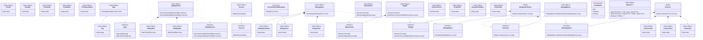

# Domain

```mermaid
classDiagram
    %% Identifiers
    class FormId {
        <<Value Object>>
        +Guid Value
    }

    class GroupId {
        <<Value Object>>
        +Guid Value
    }

    class CriterionId {
        <<Value Object>>
        +Guid Value
    }

    %% Form Metadata
    class FormCode {
        <<Value Object>>
        +string Value
    }

    class FormName {
        <<Value Object>>
        +string Value
    }

    class FormDescription {
        <<Value Object>>
        +string Value
    }

    class Tags {
        <<Value Object>>
        +ImmutableHashSet~Tag~ Items
    }

    class Tag {
        <<Value Object>>
        +string Value
    }

    class ITags {
        <<Interface>>
        +Tags Add(Tag tag)
        +Tags Remove(Tag tag)
    }

    Tags ..|> ITags
    Tags o-- Tag

    %% Validity Period
    class ValidityStart {
        <<Value Object>>
        +DateTimeOffset Value
    }

    class ValidityEnd {
        <<Value Object>>
        +DateTimeOffset Value
    }

    class ValidityPeriod {
        <<Value Object>>
        +bool IsActiveAt(DateTimeOffset moment)
        +bool IsExpiredAt(DateTimeOffset moment)
    }

    class IValidityPeriod {
        <<Interface>>
        +bool IsActiveAt(DateTimeOffset moment)
        +bool IsExpiredAt(DateTimeOffset moment)
    }

    ValidityPeriod ..|> IValidityPeriod
    ValidityPeriod *-- ValidityStart
    ValidityPeriod *-- ValidityEnd

    %% Weight
    class BasisPoints {
        <<Value Object>>
        +IPercent Percent()
        +decimal Apply(decimal value)
    }

    class Percent {
        <<Value Object>>
        +IBasisPoints Basis()
    }

    class Weight {
        <<Value Object>>
        +IPercent Percent()
        +CriterionScore PercentOf(CriterionScore score)
    }

    class IBasisPoints {
        <<Interface>>
        +IPercent Percent()
        +decimal Apply(decimal value)
    }

    class IPercent {
        <<Interface>>
        +IBasisPoints Basis()
    }

    class IWeight {
        <<Interface>>
        +IPercent Percent()
        +CriterionScore Weighted(CriterionScore score)
    }

    BasisPoints ..|> IBasisPoints
    Percent ..|> IPercent
    Weight ..|> IWeight
    Weight *-- IBasisPoints

    %% Rating Components
    class RatingScore {
        <<Value Object>>
        +ushort Value
    }

    class RatingLabel {
        <<Value Object>>
        +string Value
    }

    class RatingAnnotation {
        <<Value Object>>
        +string Value
    }

    class RatingOption {
        <<Value Object>>
        +bool Matches(RatingScore score)
    }

    class IRatingOption {
        <<Interface>>
        +bool Matches(RatingScore score)
    }

    RatingOption ..|> IRatingOption
    RatingOption *-- RatingScore
    RatingOption *-- RatingLabel
    RatingOption *-- RatingAnnotation

    class RatingOptions {
        <<Value Object>>
        +RatingOptions WithSelectedScore(RatingScore score)
    }

    class IRatingOptions {
        <<Interface>>
        +RatingOptions WithSelectedScore(RatingScore score)
    }

    RatingOptions ..|> IRatingOptions
    RatingOptions o-- IRatingOption

    %% Criterion Score
    class CriterionScore {
        <<Value Object>>
        +decimal Value
    }

    %% Criterion Components
    class CriterionTitle {
        <<Value Object>>
        +string Value
    }

    class CriterionText {
        <<Value Object>>
        +string Value
    }

    class GroupTitle {
        <<Value Object>>
        +string Value
    }

    class GroupDescription {
        <<Value Object>>
        +string Value
    }

    class OrderIndex {
        <<Value Object>>
        +ushort Value
    }

    %% Criterion Entities
    class Criterion {
        <<Entity>>
        +Option~CriterionScore~ Score()
    }

    class ICriterion {
        <<Interface>>
        +Option~CriterionScore~ Score()
    }

    class WeightedCriterion {
        <<Entity>>
        +Option~CriterionScore~ Score()
    }

    Criterion ..|> ICriterion
    WeightedCriterion ..|> ICriterion
    Criterion *-- CriterionId
    Criterion *-- CriterionText
    Criterion *-- CriterionTitle
    Criterion *-- IRatingOptions
    WeightedCriterion *-- ICriterion
    WeightedCriterion *-- IWeight

    %% Enums
    class FormStatus {
        <<Enumeration>>
        Draft
        Published
        Archived
    }

    %% Common
    class Option~T~ {
        <<Value Object>>
        +Map~TR~(Func~T,TR~ map) Option~TR~
        +Bind~TR~(Func~T,Option~TR~~ bind) Option~TR~
        +Reduce(T orElse) T
    }

    %% Exceptions
    class ScoreNotFoundException {
        <<Exception>>
        +RatingScore Score
    }

    ScoreNotFoundException --> RatingScore
```
