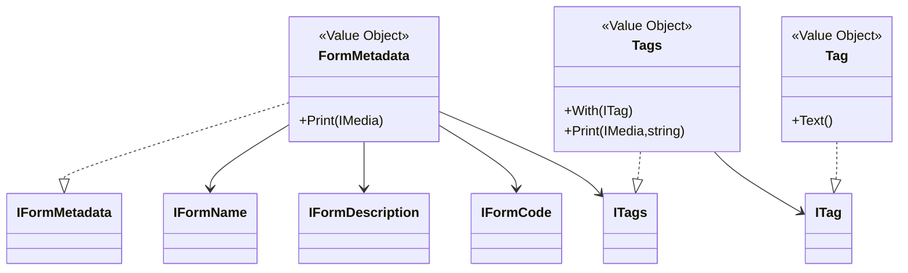
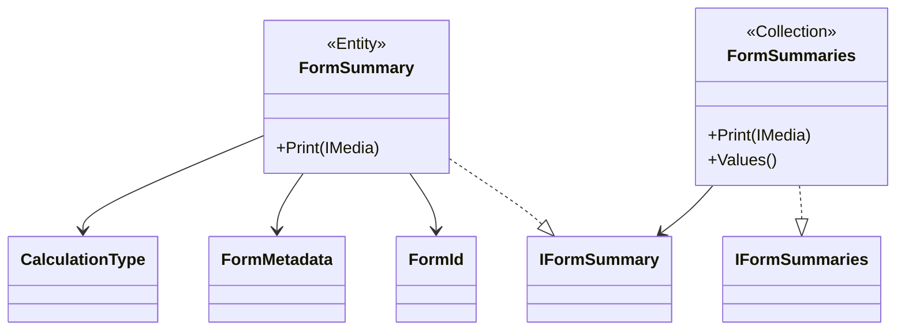
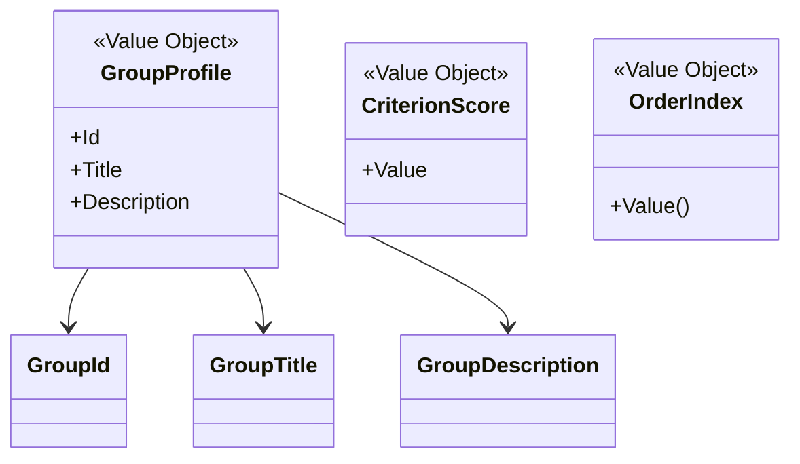
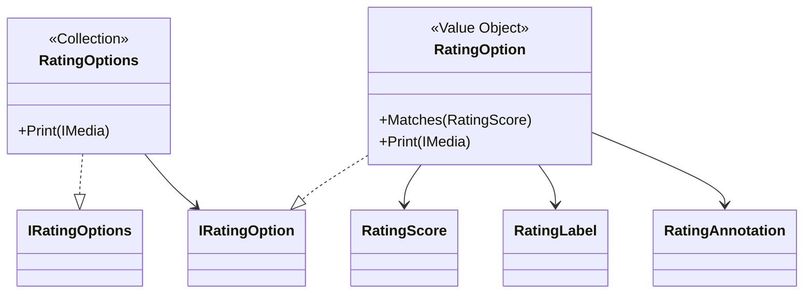
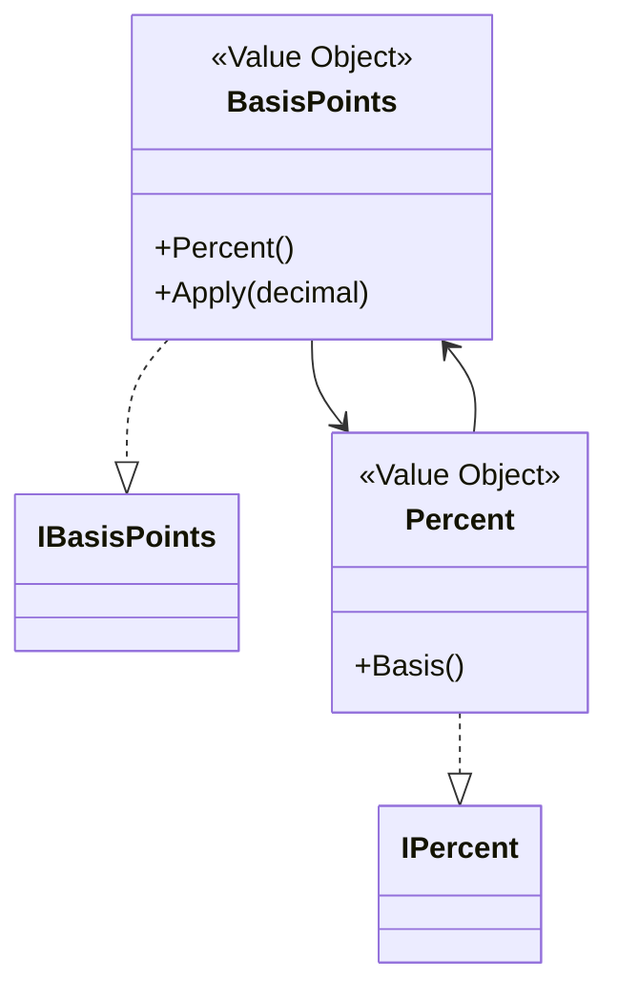
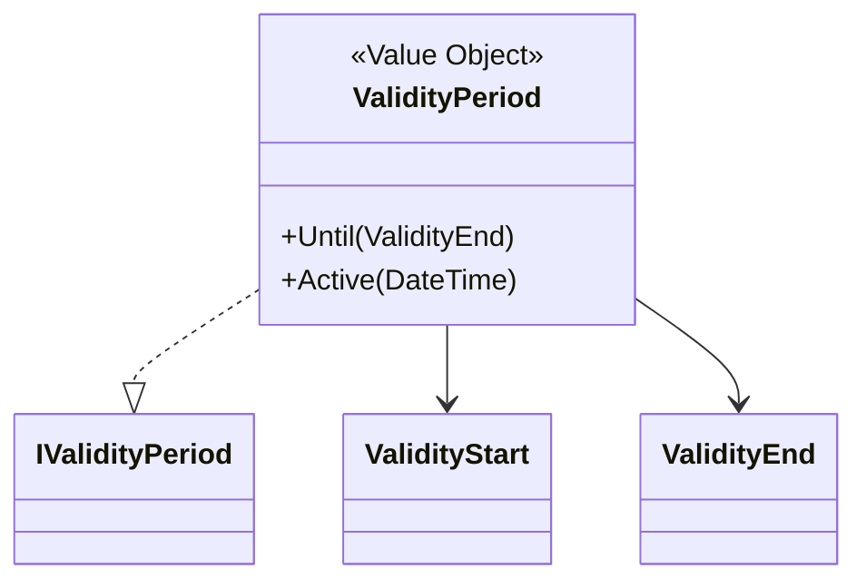
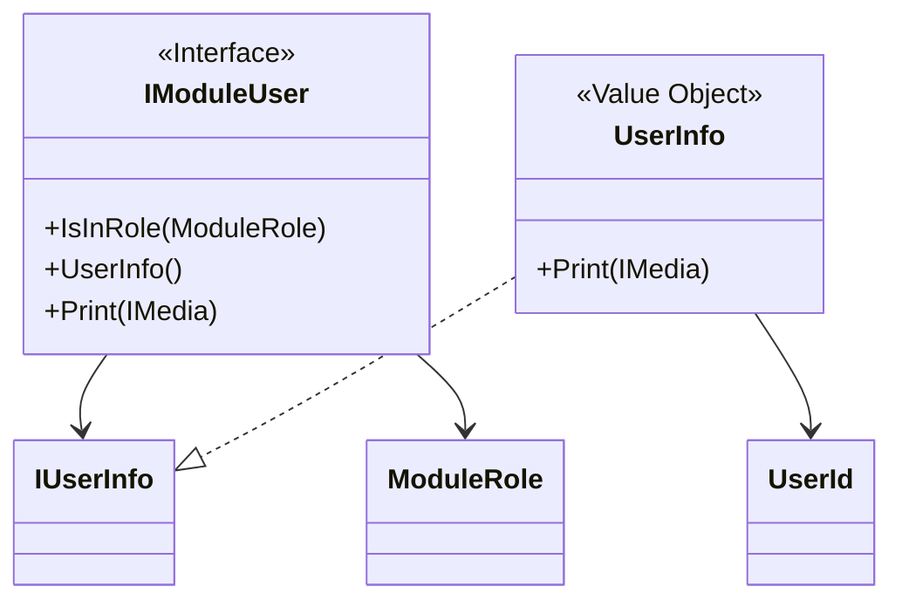

# Form Domain Model

## Scope
- `CascVel.Modules.Evaluations.Management.Domain` hosts immutable value objects and thin printable aggregates for the evaluation form bounded context; every type is compiled from `Domain.csproj`.
- Interfaces under `Domain.Interfaces.*` expose application-facing contracts, while records in `Domain.Models.*` implement them to keep the Clean/Hexagonal split explicit.
- Shared primitives (`Option<T>`, `IMedia`, measurement value objects) eliminate nulls and reflection while letting infrastructure project the domain into persistence DTOs.

## Metadata and Text Pipelines
Form metadata satisfies EVL-R-001 by enforcing required name and code, optional description, and keyword hygiene. Textual fields follow a decorator pipeline (`FormName` → `TrimmedFormName` → `ValidFormName`, the same pattern is reused for description, code, tags, group titles, criterion texts, and rating labels) so that sanitising and validation remain composable and fail fast.

`Tags.With` prevents case-insensitive duplicates in line with EVL-R-001, while `TrimmedTag` and `ValidTag` ensure canonical keyword text.

## Form Catalog Views
`FormId` wraps the aggregate identifier and is composed into `FormSummary`. The summary captures metadata, the selected `CalculationType`, and structural counters guarded by `ArgumentOutOfRangeException.ThrowIfNegative`. `FormSummaries` prints the collection through `IMedia.WithArray`, supporting projection endpoints and list queries.

`FormStatus` enumerates lifecycle states (Draft → Published → Archived) used by application services when applying EVL-R-002, EVL-R-005, and EVL-R-006.

## Structural Building Blocks
Group information is expressed through `GroupProfile`, which aggregates `GroupId`, `GroupTitle`, and `GroupDescription`. Criterion data uses `CriterionId`, `CriterionTitle`, `CriterionText`, and `CriterionScore`, each with trimming and validation decorators mirroring EVL-R-013. `OrderIndex` (EVL-R-014) preserves stable ordering for groups and criteria without relying on database defaults.

Interfaces `ICriterion`, `ICriteria`, `IGroup`, and `IGroups` describe the behaviour expected from future aggregates that will enforce EVL-R-008 and EVL-R-009; current models stay minimal until the structural tree is introduced.

## Rating Scales
Rating rules (EVL-R-015) are codified through `RatingOption`, `RatingOptions`, and their supporting value objects. The numeric domain is captured in `RatingScore` (positive `ushort`), while `RatingLabel` and `RatingAnnotation` reuse the trimming/validation pipeline. `RatingOptions.Print` emits deterministic keys, and `ScoreNotFoundException` is prepared for lookups in application services.

## Shared Measurement
Weights are expressed with interchangeable basis-points and percent views. `BasisPoints` guards the inclusive range 0..10000 and can apply itself to decimal values; `Percent` clamps 0..100 and converts back to basis points. `IWeight` stands as the contract for higher-level weight objects that will combine both views.

## Validity Window
Validity constraints from EVL-R-012 are modelled by `ValidityStart`, optional `ValidityEnd`, and `ValidityPeriod`. The period returns new instances via `Until` and validates chronology, throwing `ValidityPeriodRangeException` if the end precedes the start. `Active(DateTime)` answers availability checks without relying on system clocks.

## Identity and Authorization
User context aligns with EVL-R-011 by ensuring audit-ready identifiers. `UserId` forbids blank strings, while `UserInfo` stores optional metadata via `Option<string>` and prints through `IMedia`. `IModuleUser` exposes role checks against the `ModuleRole` enum and delegates printing to the underlying `UserInfo`.

## Serialization Contract
`IMedia` and `IMedia<TOutput>` define the printing contract used across aggregates, enabling infrastructure adapters (JSON, database commands) without leaking serialization libraries into the domain. `Option<T>` and `EnumerableExtensions.FirstOrNone` provide null-free optional handling, which is visible in identity and rating flows.

## Rule Coverage Summary
- **EVL-R-001** — `FormMetadata`, `FormName`, `FormCode`, `Tags`, and their decorators implement required metadata structure and keyword hygiene.
- **EVL-R-007** — `FormStatus` encodes lifecycle semantics for Draft, Published, and Archived states.
- **EVL-R-012** — `ValidityPeriod` and `ValidityPeriodRangeException` guarantee chronological validity windows.
- **EVL-R-013** — Criterion text/title decorators prevent blank content and cap lengths.
- **EVL-R-014** — `OrderIndex` provides explicit ordering primitives.
- **EVL-R-015** — `RatingOption` and `RatingOptions` encapsulate rating scales and prepare lookup failures via `ScoreNotFoundException`.

Structural aggregates that enforce EVL-R-008…EVL-R-010 (hierarchical groups and weight totals) are not yet implemented in the current codebase; the existing interfaces and weight primitives will host them in upcoming iterations.
