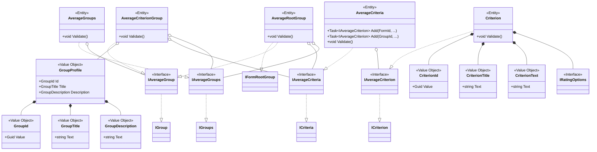

# Form Domain Model

## Aggregate Overview

The form now keeps a single structural root (`IFormRootGroup`). All other criteria and groups hang off this node, which simplifies validation and isolates distinct scoring strategies.

## Interfaces

These interfaces provide foundational contracts for validation across both Average and Weighted branches.

## Average Policy

The Average branch treats `GroupProfile` as the single bundle of identity and descriptive data. The root (`AverageRootGroup`) accepts only `IAverageCriteria` and `IAverageGroups`, preventing weighted elements from being injected.

## Weighted Average Policy

`WeightedRootGroup` works exclusively with weighted collections and enforces the root-level weight totals. Weight calculation and validation are shared between the collections (`IWeightedCriteria`, `IWeightedGroups`) and the concrete groups (`IWeightedGroup`).

## Invariants

- EVL-R-008: every criterion and subgroup resides inside the synthetic root group, enabling explicit structural validation before publication.
- EVL-R-010: for Weighted Average, sibling weights must add up to 100 % at every level, including the root, otherwise validation fails fast.
- Root objects prevent mixing implementations: `AverageRootGroup` accepts only `IAverage*`, while `WeightedRootGroup` accepts only `IWeighted*`.

These changes encode the scoring strategies in the type system and make it straightforward to wire up forms with the appropriate root object for the selected rule.

## Identity and Authorization

The module includes identity value objects and interfaces to support user context and role-based authorization:

### Value Objects

- **UserId**: String-based user identifier extracted from JWT token `sub` claim. Uses string to support various identity provider formats (GUIDs, numeric IDs, custom identifiers).

- **UserInfo**: Immutable record containing user identification and optional metadata:
  - Required: `UserId` - unique user identifier
  - Optional: `username` - login/username from `preferred_username` or `username` JWT claim
  - Optional: `name` - display name from `name` JWT claim or composed from `given_name` + `family_name`
  - Optional: `email` - email address from `email` JWT claim

  Uses `Option<string>` monad for optional fields to explicitly model absence of data. Follows Printer Pattern with `Print(IMedia)` method for serialization.

### Interfaces

- **IUserInfo**: Behavioral contract for user information value objects. Provides `Print(IMedia)` method for serialization.

- **IModuleUser**: Behavioral contract for accessing authenticated user information and checking role membership:
  - `IsInRole(ModuleRole)` - checks if user has specific module role
  - `GetUserInfo()` - returns user information as `IUserInfo`
  - `Print(IMedia)` - delegates to underlying `UserInfo.Print()`

  Implemented by infrastructure layer through `HttpContextModuleUser` which extracts claims from JWT tokens.

### Roles

Three distinct roles aligned with business domain:

- **FormDesigner**: Creates, edits, and manages evaluation forms
- **Supervisor**: Evaluates operator performance using forms
- **Operator**: Contact center agent being evaluated

### Media Abstraction

The `IMedia` interface provides methods for serializing domain objects:

- `WriteString(key, value)` - writes required string field
- `WriteOptionalString(key, Option<string>)` - writes optional string field only if present
- `WriteGuid(key, value)` - writes GUID field
- `WriteInt32(key, value)` - writes integer field
- `WriteStringArray(key, values)` - writes string array

This abstraction enables clean serialization without coupling domain objects to specific formats (JSON, XML, etc.).

See [ADR: JWT-Based Authorization](adr/20251014-jwt-based-authorization-with-module-roles.md) for authorization architecture details.
