# Form Domain Model

## Aggregate Overview

The form now keeps a single structural root (`IFormRootGroup`). All other criteria and groups hang off this node, which simplifies validation and isolates distinct scoring strategies.

## Общие интерфейсы

These interfaces remain the foundational contracts for both the Average and Weighted branches.

## Average Policy

The Average branch treats `GroupProfile` as the single bundle of identity and descriptive data. The root (`AverageRootGroup`) accepts only `IAverageCriteria` and `IAverageGroups`, preventing weighted elements from being injected.

## Weighted Average Policy

```mermaid
classDiagram
    class IWeightedCriterion {
        <<Interface>>
        +IWeight Weight()
    }

    class IWeightedCriteria {
        <<Interface>>
        +IBasisPoints Weight()
    }

    class IWeightedGroup {
        <<Interface>>
        +IWeight Weight()
    }

    class IWeightedGroups {
        <<Interface>>
        +IBasisPoints Weight()
    }

    class WeightedRootGroup {
        <<Entity>>
        +IRatingContribution Contribution()
        +void Validate()
    }

    class WeightedCriterionGroup {
        <<Entity>>
        +IRatingContribution Contribution()
        +void Validate()
        +IWeight Weight()
    }

    class WeightedCriteria {
        <<Entity>>
        +IRatingContribution Contribution()
        +IBasisPoints Weight()
        +void Validate()
    }

    class WeightedGroups {
        <<Entity>>
        +IRatingContribution Contribution()
        +IBasisPoints Weight()
        +void Validate()
    }

    class WeightedCriterion {
        <<Entity>>
        +IRatingContribution Contribution()
        +IWeight Weight()
        +void Validate()
    }

    class IBasisPoints {
        <<Interface>>
        +IPercent Percent()
        +decimal Apply(decimal value)
    }

    class IPercent {
        <<Interface>>
        +IBasisPoints Basis()
    }

    class IWeight {
        <<Interface>>
        +IPercent Percent()
        +IRatingContribution Weighted(IRatingContribution contribution)
    }

    class BasisPoints {
        <<Value Object>>
        +IPercent Percent()
        +decimal Apply(decimal value)
    }

    class Percent {
        <<Value Object>>
        +IBasisPoints Basis()
    }

    class Weight {
        <<Value Object>>
        +IPercent Percent()
        +IRatingContribution Weighted(IRatingContribution contribution)
    }

    IWeightedCriterion ..|> ICriterion
    IWeightedCriteria ..|> ICriteria
    IWeightedGroup ..|> IGroup
    IWeightedGroups ..|> IGroups
    WeightedRootGroup ..|> IFormRootGroup
    WeightedCriterionGroup ..|> IWeightedGroup
    WeightedCriteria ..|> IWeightedCriteria
    WeightedGroups ..|> IWeightedGroups
    WeightedCriterion ..|> IWeightedCriterion
    Weight ..|> IWeight
    Weight *-- IBasisPoints
    Weight --> IPercent
    BasisPoints ..|> IBasisPoints
    Percent ..|> IPercent
    BasisPoints --> Percent
    Percent --> BasisPoints
    WeightedCriterionGroup o-- GroupProfile
    WeightedCriterionGroup o-- IWeightedCriteria
    WeightedCriterionGroup o-- IWeightedGroups
    WeightedCriterionGroup *-- IWeight
    WeightedCriteria o-- IWeightedCriterion
    WeightedGroups o-- IWeightedGroup
    WeightedRootGroup o-- IWeightedCriteria
    WeightedRootGroup o-- IWeightedGroups
```

`WeightedRootGroup` works exclusively with weighted collections and enforces the root-level weight totals. Weight calculation and validation are shared between the collections (`IWeightedCriteria`, `IWeightedGroups`) and the concrete groups (`IWeightedGroup`).

## Invariants

- EVL-R-008: every criterion and subgroup resides inside the synthetic root group, enabling explicit structural validation before publication.
- EVL-R-010: for Weighted Average, sibling weights must add up to 100 % at every level, including the root, otherwise validation fails fast.
- Root objects prevent mixing implementations: `AverageRootGroup` accepts only `IAverage*`, while `WeightedRootGroup` accepts only `IWeighted*`.

These changes encode the scoring strategies in the type system and make it straightforward to wire up forms with the appropriate root object for the selected rule.
